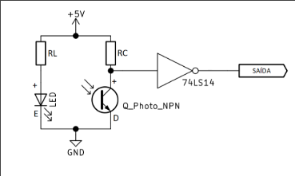

# Decodificador Óptico

No projeto do ventilador controlado por bluetooth, o decodificador óptico é utilizado para medir a velocidade do ventilador. A medição será feita com base no seguinte circuito:

Portanto, é necessário projetar RL e RC para termos a precisão correta do RPM no motor.

Para RL queremos que o LED E seja polarizado por uma corrente de 20mA:

\[R_L = \frac{Vcc}{I_E} = \frac{5}{20\cdot 10^{-3}} = 250 \Omega\]

Para o RC, seguindo o datasheet de PHCT202 para $R_{L}=100\Omega$ e VCE=5V, IC=2mA. Desta forma para a mesma corrente de coletor, temos então que $R_C = 2.5 k\Omega$